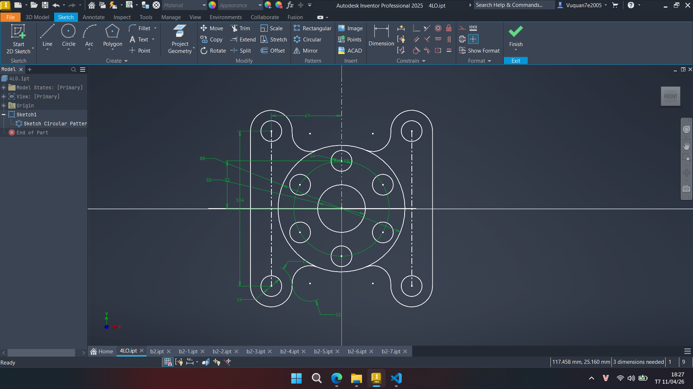
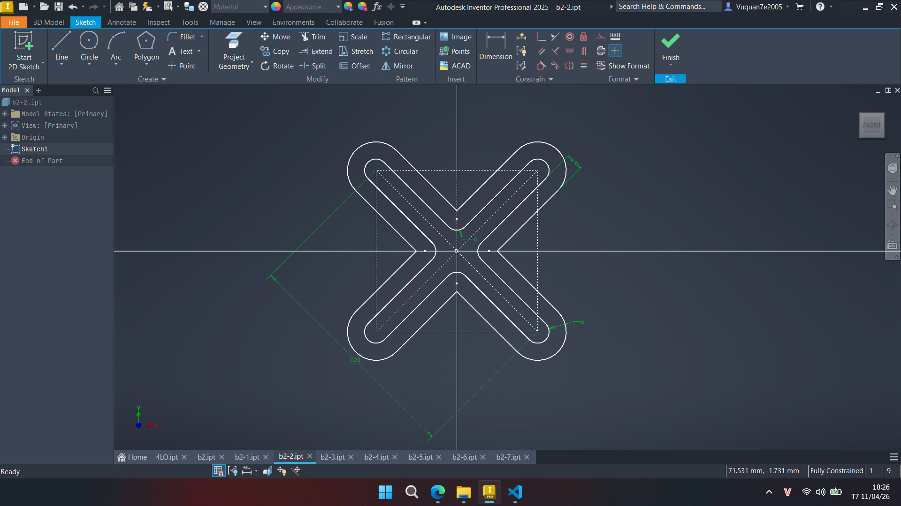
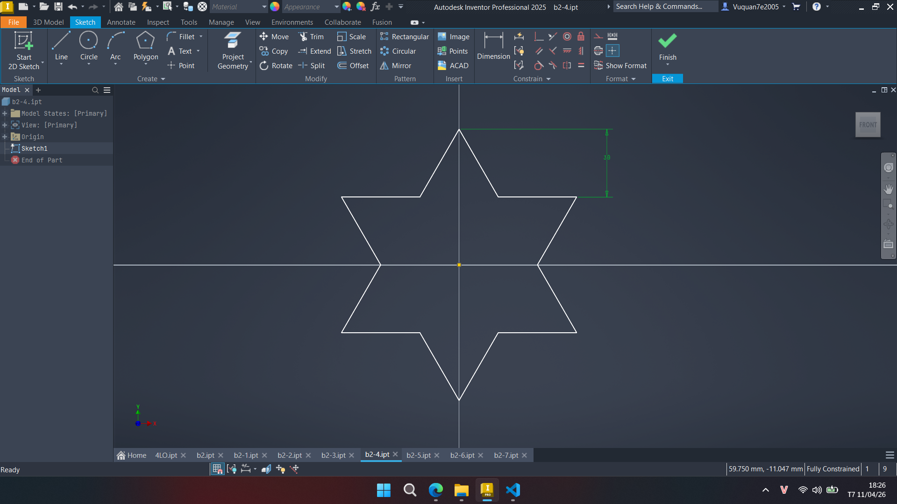

# BTB2

[📥 Tải BTB2](https://github.com/vuquan2005/4CHaUI-Inventor/releases/download/BTB2/BTB2.zip)

<details>
<summary>BBCode</summary>

```
[url=https://github.com/vuquan2005/4CHaUI-Inventor/tree/main/BTB2]BTB2[/url]

[url=https://github.com/vuquan2005/4CHaUI-Inventor/releases/download/BTB2/BTB2.zip]BTB2.zip[/url]

Link ảnh:

[img]https://raw.githubusercontent.com/vuquan2005/4CHaUI-Inventor/main/BTB2/img/4LO.png[/img]

[img]https://raw.githubusercontent.com/vuquan2005/4CHaUI-Inventor/main/BTB2/img/b2-1.png[/img]

[img]https://raw.githubusercontent.com/vuquan2005/4CHaUI-Inventor/main/BTB2/img/b2-2.png[/img]

[img]https://raw.githubusercontent.com/vuquan2005/4CHaUI-Inventor/main/BTB2/img/b2-3.png[/img]

[img]https://raw.githubusercontent.com/vuquan2005/4CHaUI-Inventor/main/BTB2/img/b2-4.png[/img]

[img]https://raw.githubusercontent.com/vuquan2005/4CHaUI-Inventor/main/BTB2/img/b2-5.png[/img]

[img]https://raw.githubusercontent.com/vuquan2005/4CHaUI-Inventor/main/BTB2/img/b2-6.png[/img]

[img]https://raw.githubusercontent.com/vuquan2005/4CHaUI-Inventor/main/BTB2/img/B2-7.png[/img]

[img]https://raw.githubusercontent.com/vuquan2005/4CHaUI-Inventor/main/BTB2/img/b2.png[/img]

```

</details>

## 📷 Hình ảnh










